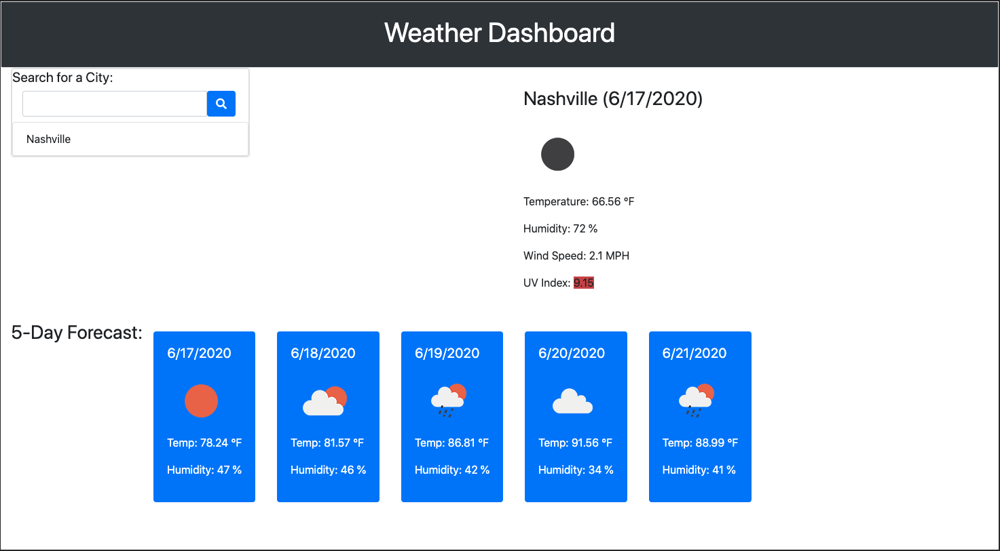

# Week-6-Server-Side-APIs-Weather-Dashboard
 
## Thomas Bragg Homework-6-Server-Side APIs: Weather Dashboard

* [Github Repository](https://github.com/TBragg800/Week-6-Server-Side-APIs-Weather-Dashboard)
* [Github Deployed Site](https://tbragg800.github.io/Week-6-Server-Side-APIs-Weather-Dashboard/)

### Summary:
This project utilizes HTML and CSS styles to build a Weather Dashboard and enact dynamic changes to the document by way of JQuery. Through the OpenWeather API the dashboard is able to retrieve weather data through 3 API calls for any city encompassed in it's library. When deployed in the browser, the dashboard allows multipule insights into the functionality and data made by those requests.

### Pseudo Code:
* create input field for city name.
* create button for search query.
* field for persisting previously searched city.
* field for the current city name, the date, an icon representation 
    of weather conditions, the temperature, the humidity, the wind 
    speed, and the UV index.
* UV Index field contains color to indicate the conditions of 
    favorable, moderate or severe.
* field containing 5-day forecast that displays the date, an icon 
    representation of weather conditions, the temperature, and the 
    humidity.
* button click to initiate search.
* variable to obtain users desired city.
* api key.
* build query URLs.
* ajax responses.
* previous city searched must append and persist.
* must parse data to get the city name, the date, an icon representation 
   of weather conditions, the temperature, the humidity, the wind speed, 
   and the UV index.
* append city data.
* UV index must change class to display a color that indicates whether the 
   conditions are favorable, moderate, or severe
* must parse data to get a 5-day forecast that displays the date, an icon 
   representation of weather conditions, the temperature, and the humidity
*   append 5-day data
* bootstrap grid layout. possibly card for current forecast 
* use container for overall sizing 

### Features:
* City specific search generated by the user.
* Persisting previously searched cities.
* Bootstrap designs and grid layout.
* Current weather data sorted by temperature, humidity, wind speed and uv index.
* A color representation of uv index condtions ranging from favorable(green), moderate(blue), or severe(red) in accordance with the EPA UV Index scale.

* A 5-Day forecast with temperature and humidity conditions. 

### Code Validator

* Code validation by W3C for HTML and CSS
* Code validation by BeautifyTools for Javascript

#### Screenshot of deployed application
